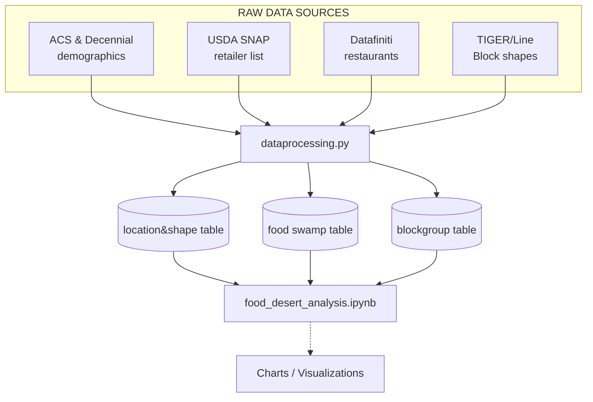
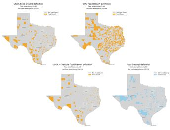

# Food Desert Analysis  

###### MADS Capstone Team: **Natalie LaRowe**, **Megan Griffin**, **Leon Gutierrez**, **Georges Michel**.  


## Project Overview  
**Food deserts** are geographic areas where residents have limited access to affordable, nutritious food. In practical terms, this often means neighborhoods (urban or rural) that lack supermarkets or grocery stores within a convenient traveling distance (“USDA ERS, Food Access Research Atlas Methodology, p. 4”). Such limited food access can contribute to poor diets and health disparities, especially among low-income populations.  

Our project tackles the problem of identifying and analyzing food deserts in Texas using multiple definitions drawn from research and government definitions. By examining food deserts through different perspectives (for example, varying how far is “too far” from a grocery store or considering whether households have a vehicle),  our project provides a thorough view of areas with inadequate food access.    

With its dynamic metropolitan metro areas and sparsely populated rural counties, Texas provides an excellent state for examining how different definitions show the food access map and mirror the nation’s desert vs. non‑desert split. In this project we:

* **Replicate four published definitions** (USDA, CDC half-mile, a transportation‑adjusted USDA variant, and a food‑swamp density rule) at the **block group** level.  
* **Compare overlap and divergence**. Revealing hotspots that every definition shows versus communities visible only under stricter distance or vehicle criteria.  
* **Propose a new definition** that captures the core features of a food desert (access distance, income, vehicle access and Rural Vs. Urban) within a well‑balanced definition.
* **Provide open, reproducible code**  so nonprofits, government agencies, health departments, and researchers can update the analysis or replicate this work in other states.

The result is a richer understanding of where Texans face barriers to healthy food options and why policy built on a single metric may miss families in need.


## Project Organization  

This repository separates data processing from analysis:

* **`dataprocessing.py`** – loads, cleans, and merges all raw data sources, computing key indicators (e.g., distance to nearest store, population thresholds) and exporting three cleaned datasets.  
* **`food_desert_analysis.ipynb`** – final Jupyter notebook that reads the cleaned dataset and applies each food‑desert definition, generating maps, charts, and comparative tables.  **<u>XXXXXXXX</u>**(update program name)


### Process Flow



`dataprocessing.py` is deliberately isolated: run it once (detailed instructions in "Getting Started" section below), and every downstream analysis will load the exact same dataset, ensuring reproducibility. 

Once food_desert_analysis notebook is run, the following food deserts maps can be seen: **<u>XXXXXXXX</u>**(update program name)

<p align="center">
  
</p>

### Raw Data Sources

* **United States Census Bureau.**  
  [Census Data – Decennial DHC 2020, ACS, and other tables](https://data.census.gov/table)  
  *Block group level demographics (i.e. income, poverty, vehicle access, race/ethnicity)*

* **United States Census Bureau.**  
  [TIGER/Line 2023 Block Group Shapefiles (tl_2023_48_bg.zip)](https://www2.census.gov/geo/tiger/TIGER2023/BG/tl_2023_48_bg.zip)  
  *Spatial boundaries for every Texas block group, enabling map joins and geospatial analysis.*

* **U.S. Department of Agriculture, Economic Research Service.**  
  [Food Access Research Atlas](https://www.ers.usda.gov/data-products/food-access-research-atlas/)  
  *National database identifying variables like low‑access and low‑income census tracts (our baseline “food‑desert” reference).*

* **U.S. Department of Agriculture, Food and Nutrition Service.**  
  [SNAP Retailer Locator – Historical Data](https://www.fns.usda.gov/snap/retailer/historical-data)  
  *Comprehensive list of authorized SNAP retailers, used to measure healthy‑food availability.*

* **Kaggle.** *Fast Food Restaurants* dataset (Datafiniti, 2019).  
  <https://www.kaggle.com/datasets/datafiniti/fast-food-restaurants>  
  *Nation‑wide point locations for quick‑service restaurants, helping flag “food‑swamp” density.*

  

  ### Methodologies Implemented  

  | #    | Definition                       | Criteria                                                     | General Metrics                                        |
  | ---- | -------------------------------- | :----------------------------------------------------------- | ------------------------------------------------------ |
  | 1    | **USDA Low‑Income / Low‑Access** | Poverty ≥ 20 % **AND** nearest supermarket > 1 mi (urban) / 10 mi (rural) | Distance + Income                                      |
  | 2    | **CDC Half‑Mile Access**         | No supermarket within the block group **OR** within 0.5 mi of its boundary (income not required) | Distance                                               |
  | 3    | **USDA + Vehicle Accessibility** | Low‑income **AND** (≥ 10 % households w/o vehicle & > 0.5 mi to store **OR** > 20 mi to store) | Distance + Income + Vehicle Access                     |
  | 4    | **Food Swamp Density**           | Unhealthy outlets (fast food + convenience) > healthy supermarkets inside block group | Fast Food Density / Grocery Ratio                      |
  | 5    | **Proposed Definition**          | **<u>XXXXXXXX</u>**(update definition)                       | Distance + Income + Vehicle Access + Urban/Rural split |

  Each definition is implemented as a reusable Python function in the notebook so users can **adjust** thresholds or **add** new metrics.  

  

## Getting Started – Run the Project in 4 Steps

**Prerequisites**  
> • Python 3.10+   
> • ~2 GB free disk space (datasets are downloaded on first run)  

1. **Clone the repository**

   ```bash
   git clone https://github.com/natalielarowe/MADS_Capstone.git
   ```

2. **Install the required packages in *your* preferred environment**

   Create or activate a Python environment of your choice. **Activate the environment first**, then install the project dependencies:

   ```shell
   pip install -r requirements.txt      
   ```

3. **Manually download the block level shapefile (one‑time download)**

   Because the file is too large for GitHub, you must place the ZIP in the repo manually.

   (i) In your browser, download **`tl_2023_48_bg.zip`** from:  
      <https://www2.census.gov/geo/tiger/TIGER2023/BG/tl_2023_48_bg.zip>

   (ii) <u>**Do not unzip.**</u> Simply move the file from your local downloads directory into the project’s root folder (the same folder that contains this `README.md`).  
   
      The code looks for `tl_2023_48_bg.zip` in that location and will read it directly.

4. **Open the following Jupyter Notebook and run it**

   ```shell
   jupyter notebook food_desert_analysis.ipynb        # Any other app like VSC can be used
   ```

   

## Proposed approaches for future work 

* **Update to ACS 2022** : Once the 2022 5-year tables are released (capturing post‑pandemic demographic shifts).  
* **Interactive dashboard**: Deploy an interactive web application (i.e. Dash) to allow users interact with the thresholds (like poverty %  levels or distances) and instantly redraw maps.  
* **Transit layer** : Incorporate public transportation routes to test whether proximity by "travel time" changes which tracts qualify.  
* **Chronic Diseases link** : Statistically model which definition best predicts diabetes or obesity rates, refining current work criteria.

## Acknowledgments  
We are deeply grateful to our project mentor **Dr. Gabrielle O’Brien**, for her continuous guidance and encouragement. We extend sincere thanks to the entire MADS faculty and every teaching assistant, whose dedication has improved not only our technical skills but also the teamwork and communication abilities that moved this project ahead. Finally, we acknowledge the USDA Economic Research Service and the U.S. Census Bureau for making open data freely available.


